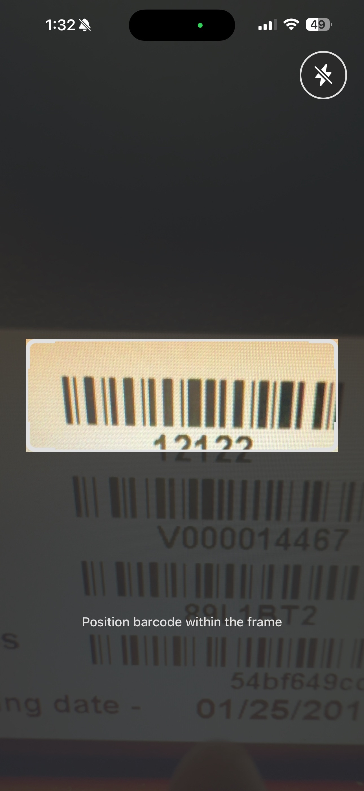
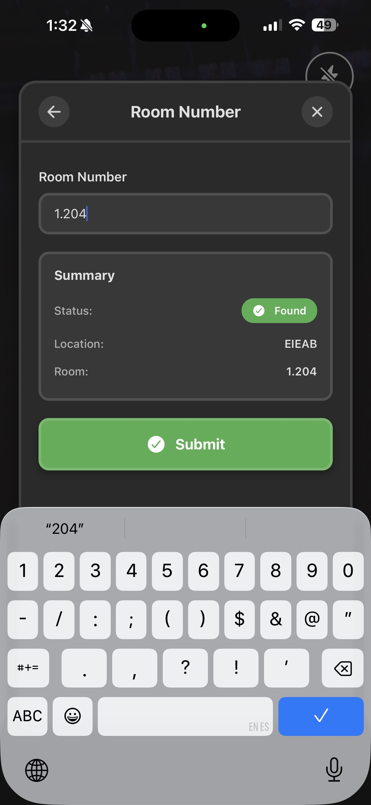

# Barcode Scanner for CS

Mobile barcode scanning app for asset inventory management.

Scan barcodes → Select status → Choose building → Enter room → Submit. Data automatically syncs to Excel (Sheet1 for inventory, Other for non-inventory items).

## Screenshots

  
  
  
  
  

## Setup

Each command on seperate terminals
npm run server
ngrok http 3000
Update database.js with url provided by ngrok
npx expo start --tunnel